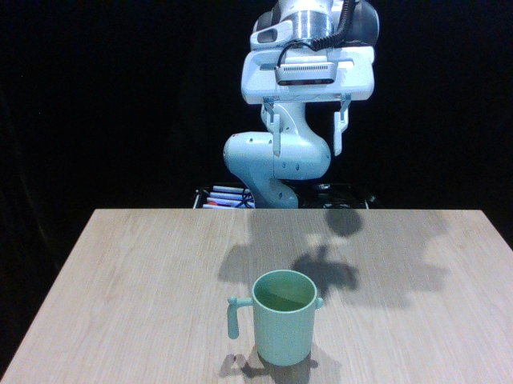
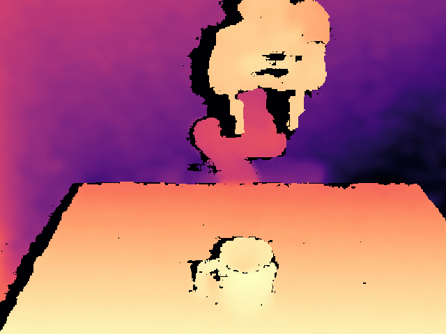
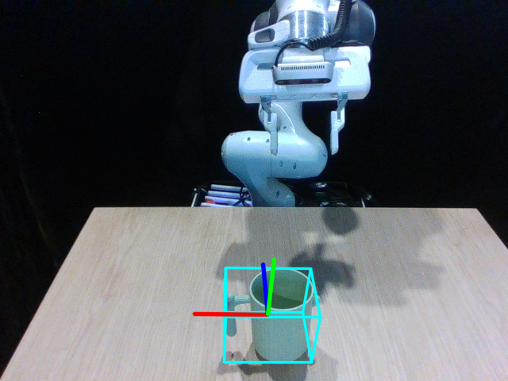

# SAR-Net: Shape Alignment and Recovery Network for Category-level 6D Object Pose and Size Estimation


<table>
  <tr>
    <td></td>
    <td></td>
    <td></td>
  </tr>
</table>


## 📝 Overview
This repository contains the PyTorch implementation of the paper "SAR-Net: Shape Alignment and Recovery Network for Category-level 6D Object Pose and Size Estimation"
[[PDF](https://openaccess.thecvf.com/content/CVPR2022/papers/Lin_SAR-Net_Shape_Alignment_and_Recovery_Network_for_Category-Level_6D_Object_CVPR_2022_paper.pdf)]
[[Supp](https://openaccess.thecvf.com/content/CVPR2022/supplemental/Lin_SAR-Net_Shape_Alignment_CVPR_2022_supplemental.zip)]
[[arXiv](https://arxiv.org/pdf/2106.14193.pdf)].
Our approach could recover the 6-DoF pose and 3D size of category-level objects from the cropped depth image.

For more results and robotic demos, please refer to our [Webpage](https://hetolin.github.io/SAR-Net/).

## 💫 Follow-up works
- **Our follow-up ICCV2023 work**:
  - PourIt!🫗: Weakly-supervised Liquid Perception from a Single Image for Visual Closed-Loop Robotic Pouring [[Project Page](http://hetolin.github.io/PourIt)] [[PDF](https://arxiv.org/pdf/2307.11299.pdf)] [[arXiv](https://arxiv.org/pdf/2307.11299.pdf)] [[Supp](https://openaccess.thecvf.com/content/ICCV2023/supplemental/Lin_PourIt_Weakly-Supervised_Liquid_ICCV_2023_supplemental.zip)]

[//]: # ()


## 📚 Dependencies
* Python >= 3.6
* PyTorch >= 1.4.0
* CUDA >= 10.1


## ⚙️ Installation
```
conda create -n sarnet python=3.6
conda activate sarnet

pip install -r requirements.txt
```

## 📊 Prepare Dataset
* Download [[camera_train_processed](https://drive.google.com/file/d/1DzqX5OQIOo44viQepPXZfWUXmb1WLZhc/view?usp=share_link)]
  that we have preprocessed.
* Download [[CAMERA/val](http://download.cs.stanford.edu/orion/nocs/camera_val25K.zip)],
  [[Real/test](http://download.cs.stanford.edu/orion/nocs/real_test.zip)],
  [[gts](http://download.cs.stanford.edu/orion/nocs/gts.zip)], 
  [[obj_models](http://download.cs.stanford.edu/orion/nocs/obj_models.zip)] and 
  [[nocs_results](https://drive.google.com/file/d/1p72NdY4Bie_sra9U8zoUNI4fTrQZdbnc/view?usp=sharing)]
  provided by [NOCS](https://github.com/hughw19/NOCS_CVPR2019).
* Download [[mrcnn_mask_results](https://drive.google.com/file/d/1RwAbFWw2ITX9mXzLUEBjPy_g-MNdyHET/view)] provided by 
  [DualPoseNet](https://github.com/Gorilla-Lab-SCUT/DualPoseNet).


Unzip and organize these files in `./data/NOCS` and `./results/NOCS` as follows:
```
data
└── NOCS
    ├── camera_train_processed
    ├── template_FPS
    ├── CAMERA
    │   ├── val 
    │   └── val_list.txt
    ├── Real
    │   ├── test 
    │   └── test_list.txt
    ├── gts
    │   ├── cam_val
    │   └── real_test
    └── obj_models
        ├── val
        └── real_test
   

results
└── NOCS
    ├── mrcnn_mask_results
    │   ├── cam_val
    │   └── real_test
    └── nocs_results
        ├── val
        └── real_test
        
```

```
python preprocess/shape_data.py
python preprocess/pose_data.py
python generate_json.py
```

## 🌟 NOTE
**NOTE** that there is a small bug in the original evaluation [code](https://github.com/hughw19/NOCS_CVPR2019/blob/78a31c2026a954add1a2711286ff45ce1603b8ab/utils.py#L252) of NOCS w.r.t. IOU.
We fixed this bug in our evaluation [code](https://github.com/hetolin/SAR-Net/blob/bb208a5727089c9c9d0b0bd46bbbd1de3198df05/lib/utils_pose.py#L254) and re-evaluated our method.
Also thanks [Peng et al.](https://github.com/swords123/SSC-6D/blob/bb0dcd5e5b789ea2a80c6c3fa16ccc2bf0a445d1/eval/utils.py#L114) for further confirming this bug.

## 🪄 Demo
```
python demo.py --config ./config_evaluate/nocs_real_mrcnn_mask.txt
```
The predict results will be saved in the folder of `./examples`
<table>
  <tr>
    <td></td>
    <td></td>
    <td></td>
  </tr>
</table>

## ⏳ Training
```
modified the ${gpu_id} in config_sarnet.py

# using a single GPU
e.g. gpu_id = '0' 

# using multiple GPUs
e.g. gpu_id = '0,1,2,3'

python train_sarnet.py
```

## 🪄 Evaluation
We provide the `pretrain models` of `3D-GCN`(./checkpoints/NOCS/pretrained/seg3d) and 
`SAR-Net`(./checkpoints/NOCS/pretrained/sarnet) for fast evaluation.
```
python evaluate.py --config ./config_evaluate/nocs_real_mrcnn_mask.txt
```
We also provide the [results](https://drive.google.com/drive/folders/1dzfvO-HePuOpS6FlCTO0pn1nhTFTmlmW?usp=sharing) 
reported in our paper for comparison.
 


## 🔖 Citation
If you find our work helpful, please consider citing:
```
@InProceedings{Lin_2022_CVPR,
    author    = {Lin, Haitao and Liu, Zichang and Cheang, Chilam and Fu, Yanwei and Guo, Guodong and Xue, Xiangyang},
    title     = {SAR-Net: Shape Alignment and Recovery Network for Category-Level 6D Object Pose and Size Estimation},
    booktitle = {Proceedings of the IEEE/CVF Conference on Computer Vision and Pattern Recognition (CVPR)},
    month     = {June},
    year      = {2022},
    pages     = {6707-6717}
}
```

## 🌹 Acknowledgment
Our implementation leverages the code from [NOCS](https://github.com/hughw19/NOCS_CVPR2019), [SPD](https://github.com/mentian/object-deformnet/tree/master) and [3DGCN](https://github.com/zhihao-lin/3dgcn). Thanks for the authors' work.