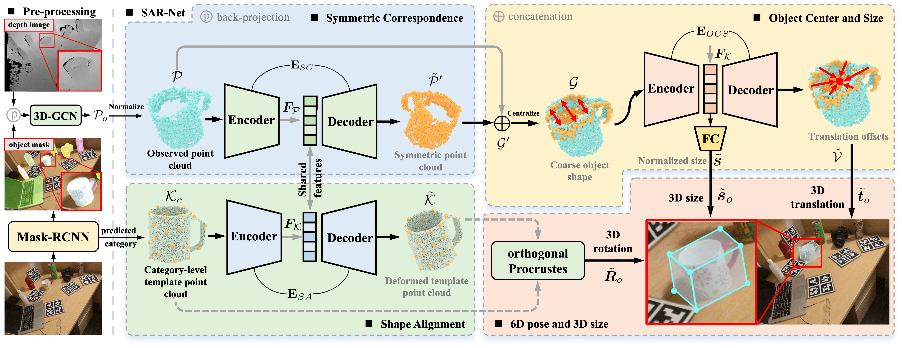

# SAR-Net: Shape Alignment and Recovery Network for Category-level 6D Object Pose and Size Estimation



## Overview
This repository contains the PyTorch implementation of the paper "SAR-Net: Shape Alignment and Recovery Network for Category-level 6D Object Pose and Size Estimation"
[[pdf](https://openaccess.thecvf.com/content/CVPR2022/papers/Lin_SAR-Net_Shape_Alignment_and_Recovery_Network_for_Category-Level_6D_Object_CVPR_2022_paper.pdf)]
[[supp](https://openaccess.thecvf.com/content/CVPR2022/supplemental/Lin_SAR-Net_Shape_Alignment_CVPR_2022_supplemental.zip)]
[[arXiv](https://arxiv.org/pdf/2106.14193.pdf)].
Our approach could recover the 6-DoF pose and 3D size of category-level objects from the cropped depth image.

For more results and robotic demos, please refer to our [Webpage](https://hetolin.github.io/SAR-Net/).


## Dependencies
* Python >= 3.6
* PyTorch >= 1.4.0
* CUDA >= 10.1


## Installation
```
pip install -r requirements.txt
```


## Prepare Dataset
* Download [camera_train_processed](https://drive.google.com/file/d/1DzqX5OQIOo44viQepPXZfWUXmb1WLZhc/view?usp=share_link) that we have preprocessed.
* Download [camera_val](http://download.cs.stanford.edu/orion/nocs/camera_val25K.zip),
 [real_test](http://download.cs.stanford.edu/orion/nocs/real_test.zip),
[ground-truth annotations](http://download.cs.stanford.edu/orion/nocs/gts.zip)
provided by [NOCS](https://github.com/hughw19/NOCS_CVPR2019).
* Download [segmentation results](https://drive.google.com/file/d/1RwAbFWw2ITX9mXzLUEBjPy_g-MNdyHET/view) 
provided by [DualPoseNet](https://github.com/Gorilla-Lab-SCUT/DualPoseNet). 


Unzip and organize these files in `./data/NOCS` and `./results/NOCS` as follows:
```
data
└── NOCS
    ├── CAMERA
    │   ├── val 
    │   └── val_list.txt
    ├── Real
    │   ├── test 
    │   └── test_list.txt
    ├── gts
    │   ├── cam_val
    │   └── real_test
    ├── camera_train_processed
    └── template_FPS

results
└── NOCS
    └── mrcnn_mask_results
        ├── cam_val
        └── real_test
```

```
python generate_json.py
```

## NOTE

**NOTE** that there is a small bug in the original evaluation [code](https://github.com/hughw19/NOCS_CVPR2019/blob/78a31c2026a954add1a2711286ff45ce1603b8ab/utils.py#L252) of NOCS w.r.t. IOU.
We fixed this bug in our evaluation [code](https://github.com/hetolin/SAR-Net/blob/bb208a5727089c9c9d0b0bd46bbbd1de3198df05/lib/utils_pose.py#L254) and re-evaluated our method.
Also thanks [Peng et al.](https://github.com/swords123/SSC-6D/blob/bb0dcd5e5b789ea2a80c6c3fa16ccc2bf0a445d1/eval/utils.py#L114) for further confirming this bug.


## Training
```
modified the ${gpu_id} in config_sarnet.py

# using single GPU
e.g. gpu_id = '0'

# using multiple GPUs
e.g. gpu_id = '0,1,2,3'

python train_sarnet.py
```

## Evaluation
```
python evaluate.py --config ./config_evaluate/nocs_real_mrcnn_mask.txt
```
We also provide the [results](https://drive.google.com/drive/folders/1dzfvO-HePuOpS6FlCTO0pn1nhTFTmlmW?usp=sharing) 
reported in our paper for comparison.
 
## Citation
If you find our work helpful, please consider citing:
```
@InProceedings{Lin_2022_CVPR,
    author    = {Lin, Haitao and Liu, Zichang and Cheang, Chilam and Fu, Yanwei and Guo, Guodong and Xue, Xiangyang},
    title     = {SAR-Net: Shape Alignment and Recovery Network for Category-Level 6D Object Pose and Size Estimation},
    booktitle = {Proceedings of the IEEE/CVF Conference on Computer Vision and Pattern Recognition (CVPR)},
    month     = {June},
    year      = {2022},
    pages     = {6707-6717}
}
```

## Acknowledgment
Our implementation leverages the code from [NOCS](https://github.com/hughw19/NOCS_CVPR2019), [SPD](https://github.com/mentian/object-deformnet/tree/master) and [3DGCN](https://github.com/zhihao-lin/3dgcn). Thanks for the authors' work.